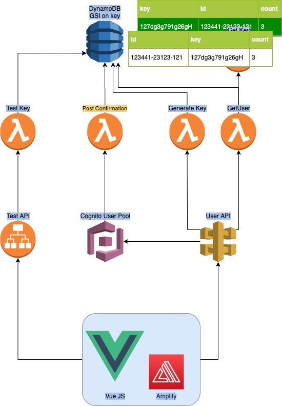
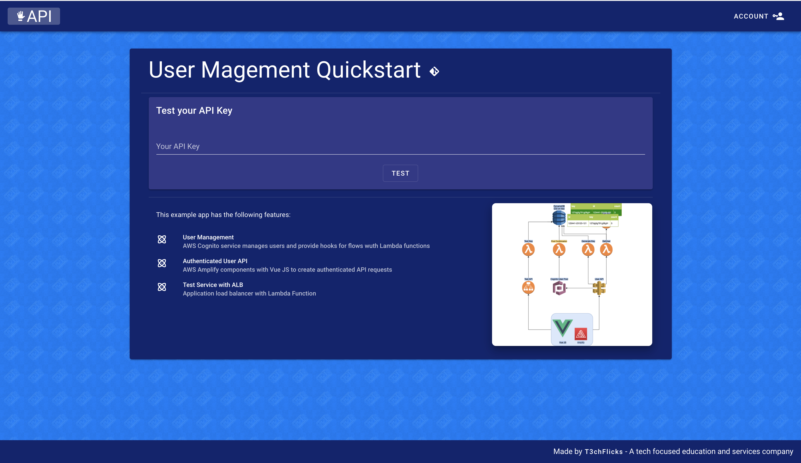

# User Manager App Example with Cognito using AWS CloudFormation
This project is an example User Manager app which allows you to register users, and monitor their usage of a service API 
with key authentication. 
The infrastruture is written using CloudFormation.
* The blog post can be found [here](https://medium.com/@t3chflicks).
* Live demo can be found [here 💽](https://um-app.t3chflicks.org).

# Step By Step Instructions
1. This project expects you to bring your own domain hosted on Route53 and with SSL certificates for both the region of your service and US-EAST-1.
    1. [Get a domain on AWS](https://aws.amazon.com/getting-started/hands-on/get-a-domain/) 
    1. Create a [hosted zone on Route53](https://docs.aws.amazon.com/Route53/latest/DeveloperGuide/CreatingHostedZone.html)
    1. Create two [HTTPS Certificates](https://aws.amazon.com/certificate-manager/)
        * One for your region e.g. eu-west-1
        * One for cloudfront which must be us-east-1
1. Deploy `00-infra.yml` to create code bucket, certificate, and email alerts.
    * ```
        aws cloudformation deploy --template-file ./00-infra.yml
        --stack-name um-infra --region=<your_region>  
        --capabilities CAPABILITY_NAMED_IAM 
        --parameter-overrides RootDomain=<your_domain> 
                              RegionalCertArn=<your_cert_arn> 
                              HostedZoneId=<your_id> 
                              CloudFrontCertArn=<your_cert_arn> 
                              EmailAddress=<your_email>  
        ```
1. Deploy `01-vpc.yml` to create vpc
    * ```
        aws cloudformation deploy --template-file ./01-vpc.yml --stack-name um-vpc
      ```
1. Deploy `02-tables.yml` to create user and product tables
    *   ```
        aws cloudformation deploy --template-file ./02-tables.yml --stack-name um-tables
        ```
1. Deploy `03-congito.yml` to create the user pool and post confirmation function
    * Package PostConfirmation Lambda functions ([see here how to package Python Lambda](https://docs.aws.amazon.com/lambda/latest/dg/python-package.html))
    * ```
        aws s3 cp PostConfirmation.zip s3://um-infra-codebucket-***/
      ```
    * ```
        aws cloudformation deploy --template-file ./03-cognito.yml --stack-name um-cognito 
        --region=<your_region>  --capabilities CAPABILITY_NAMED_IAM
      ```
1. Deploy `04-user-api.yml` to create the user api and create functions 
    * ```
        aws s3 cp GenerateKey.zip s3://um-infra-codebucket-***/
      ```
    * ```
        aws s3 cp GetUser.zip s3://um-infra-codebucket-***/
      ```  
    * ```
        aws cloudformation deploy --template-file ./04-user-api.yml --stack-name um-user-api 
        --region=<your_region>  --capabilities CAPABILITY_NAMED_IAM
      ```
1. Deploy `05-test-service.yml` as an example service running on the load balancer which verifies the user request
    * ```
        aws s3 cp TestKey.zip s3://um-infra-codebucket-***/
      ```    
    * ```
        aws cloudformation deploy --template-file ./05-test-api.yml 
        --stack-name um-test-api --region=<your_region>  --capabilities CAPABILITY_NAMED_IAM
      ```
1. Deploy `06-site.yml` 
    * ```
        aws cloudformation deploy --template-file ./06-site.yml 
        --stack-name um-site --region=<your_region>   --capabilities CAPABILITY_NAMED_IAM      
      ```
1. Add parameters to `frontend/src/main.js`
    * Root Domain
    * Region
    * UserApiUrl
    * TestApiUrl
    * CognitoUserPoolId
    * CognitoUserPoolClientId
1. Build
    * `npm run build`
1. Deploy to S3 bucket
    * ```
        aws s3 cp ./dist s3://um-app.YOUR_DOMAIN --recursive
      ```


# How it works
Please see Medium article for in depth breakdown [here](https://medium.com/@t3chflicks).
### Architecture Overview


### Screenshots
Home Page

User Page


## Extra Info 
* [AWS Cloudfront Region](https://docs.aws.amazon.com/AmazonCloudFront/latest/DeveloperGuide/cnames-and-https-requirements.html)
    * AWS Region that You Request a Certificate In (for AWS Certificate Manager)

